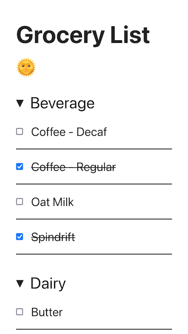
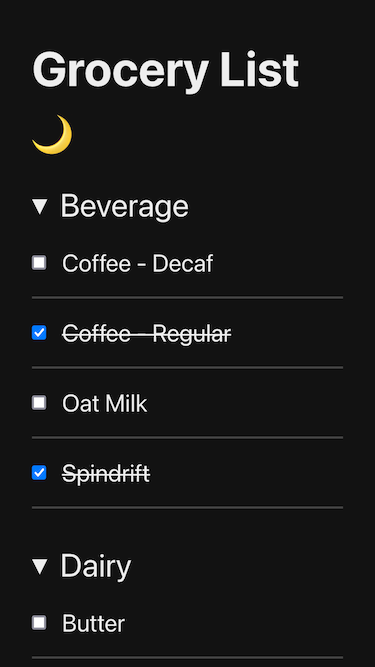

# Grocery List App

  
  

A simple mobile friendly app to take while grocery shopping, powered by Google Sheets & ReactJS.

## Customizing for Your Own Use

To personalize this app for yourself follow these steps after forking this repository:

1. Create a Google Sheet with the fields "items", "category", and "include". Make sure to set the values of the "include" field to be a checkbox which evaluates to "TRUE" or "FALSE" when checked or unchecked. This determines whether or not an item will display in the app.

2. After adding your grocery items and categories as rows, make the sheet public by clicking the "Share" button in the upper right and then setting "General Access" to "Anyone with the link".

3. Copy the sheet's unique key in the URL, it's the part that comes after `https://docs.google.com/spreadsheets/d/` and before the next slash (`/`).

4. Update the `.env` file so that this unique key is the value of `REACT_APP_SHEET_KEY`. You won't need to modify the value of `REACT_APP_SHEET_NAME` unless you named the sheet in your Google Sheet something different (it defaults to "Sheet1").

5. After running the app locally and verifying that it works, do `npm run deploy` to create a production build and add those build artifacts to a `gh-pages` branch in git / Github.

6. In the Github repository settings make sure that Pages is enabled from the `gh-pages` branch.

The app should now be viewable on `https://username.github.io/grocery-list-app/`. Enjoy!

---

## Getting Started with Create React App

This project was bootstrapped with [Create React App](https://github.com/facebook/create-react-app).

## Available Scripts

In the project directory, you can run:

### `npm start`

Runs the app in the development mode.\
Open [http://localhost:3000](http://localhost:3000) to view it in the browser.

The page will reload if you make edits.\
You will also see any lint errors in the console.

### `npm test`

Launches the test runner in the interactive watch mode.\
See the section about [running tests](https://facebook.github.io/create-react-app/docs/running-tests) for more information.

### `npm run build`

Builds the app for production to the `build` folder.\
It correctly bundles React in production mode and optimizes the build for the best performance.

The build is minified and the filenames include the hashes.\
Your app is ready to be deployed!

See the section about [deployment](https://facebook.github.io/create-react-app/docs/deployment) for more information.

### `npm run eject`

**Note: this is a one-way operation. Once you `eject`, you can’t go back!**

If you aren’t satisfied with the build tool and configuration choices, you can `eject` at any time. This command will remove the single build dependency from your project.

Instead, it will copy all the configuration files and the transitive dependencies (webpack, Babel, ESLint, etc) right into your project so you have full control over them. All of the commands except `eject` will still work, but they will point to the copied scripts so you can tweak them. At this point you’re on your own.

You don’t have to ever use `eject`. The curated feature set is suitable for small and middle deployments, and you shouldn’t feel obligated to use this feature. However we understand that this tool wouldn’t be useful if you couldn’t customize it when you are ready for it.

## Learn More

You can learn more in the [Create React App documentation](https://facebook.github.io/create-react-app/docs/getting-started).

To learn React, check out the [React documentation](https://reactjs.org/).
